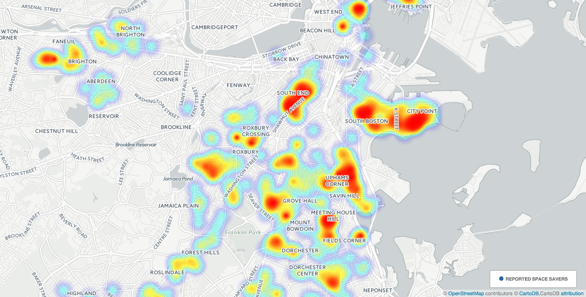
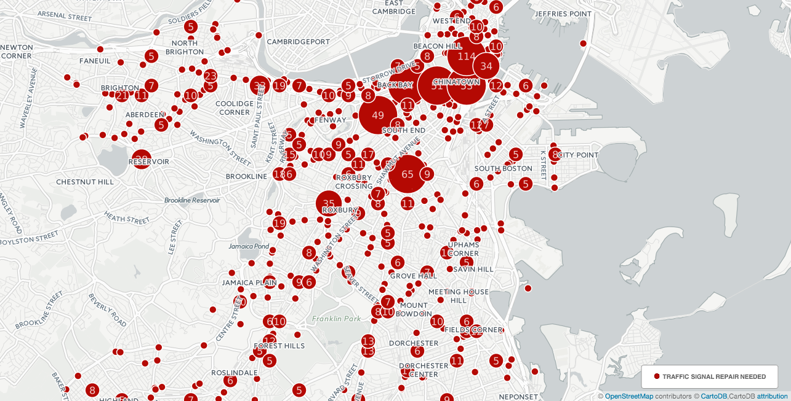

# bostonservicemap
Boston Service Map - Visualization of 311 service calls in Metro Boston

<h3>Notes</h3>

-Csv data grouped by CASE TYPE in 2015. Raw csv data available in /cartoDB_Data/.

-Using <a href='https://cartodb.com/'> CartoDB </a> to display data.

-Reported 311 call data parsed from <a href='https://data.cityofboston.gov/City-Services/311-Service-Requests/awu8-dc52'>311 City of Boston</a>

<a href='https://johnliao.cartodb.com/viz/89a9f1dc-bb3d-11e5-8f12-0e674067d321/embed_map'> Interactive Map!</a>

<h2>Available data:</h2>

Abandoned Bicycle.csv
Abandoned Building.csv
Abandoned Vehicles.csv
Aircraft Noise Disturbance.csv
Alert Boston.csv
Animal Found.csv
Animal Generic Request.csv
Animal Lost.csv
Animal Noise Disturbances.csv
Automotive Noise Disturbance.csv
Bed Bugs.csv
Bicycle Issues.csv
Big Buildings Online Request.csv
Big Buildings Recycling (INTERNAL).csv
Billing Complaint.csv
Breathe Easy.csv
Bridge Maintenance.csv
Building Inspection Request.csv
BWSC General Request.csv
BWSC Pothole.csv
Call Log.csv
Carbon Monoxide.csv
Catchbasin.csv
CE Collection.csv
Cemetery Maintenance Request.csv
Checkin.csv
Construction Debris.csv
Contractor Complaints.csv
Contractors Complaint.csv
Cross Metering - Sub-Metering.csv
Downed Wire.csv
Dumpster & Loading Noise Disturbances.csv
Egress.csv
Electrical.csv
Empty Litter Basket.csv
Equipment Repair.csv
Exceeding Terms of Permit.csv
Fire Department Request.csv
Fire Hydrant.csv
Fire in Food Establishment.csv
Food Alert - Confirmed.csv
Food Alert - Unconfirmed.csv
General Comments For a Program or Policy.csv
General Comments For An Employee.csv
General Lighting Request.csv
General Traffic Engineering Request.csv
Graffiti Removal.csv
Ground Maintenance.csv
Heat - Excessive  Insufficient.csv
Highway Maintenance.csv
Housing Discrimination Intake Form.csv
Idea Collection.csv
Illegal Auto Body Shop.csv
Illegal Dumping.csv
Illegal Occupancy.csv
Illegal Posting of Signs.csv
Illegal Rooming House.csv
Improper Storage of Trash (Barrels).csv
Install New Lighting.csv
Item Price Missing.csv
Knockdown Replacement.csv
Lead.csv
Litter Basket Maintenance.csv
Maintenance - Homeowner.csv
Maintenance Complaint - Residential.csv
Major System Failure.csv
MBTA Request.csv
Mechanical.csv
Metrolist Survey.csv
Mice Infestation - Residential.csv
Misc. Snow Complaint.csv
Missing Sign.csv
Mosquitoes (West Nile).csv
Municipal Parking Lot Complaints.csv
Needle Pickup.csv
New Sign  Crosswalk or Pavement Marking.csv
New Tree Requests.csv
News Boxes.csv
No Utilities - Food Establishment - Electricity.csv
No Utilities - Food Establishment - Water.csv
No Utilities Residential - Electricity.csv
No Utilities Residential - Gas.csv
No Utilities Residential - Water.csv
No-Tow Complaint Confirmation.csv
Notification.csv
OCR Front Desk Interactions.csv
OCR Metrolist.csv
Overcrowding.csv
Overflowing or Un-kept Dumpster.csv
Park Improvement Requests.csv
Parking Enforcement.csv
Parking Meter Repairs.csv
Parks General Request.csv
Pavement Marking Inspection.csv
Pavement Marking Maintenance.csv
Pest Infestation - Residential.csv
Phone Bank Service Inquiry.csv
Pick up Dead Animal.csv
Pigeon Infestation.csv
Planting.csv
Plumbing.csv
Poor Conditions of Property.csv
Poor Ventilation.csv
Pothole Repair (Internal).csv
Private Parking Lot Complaints.csv
Protection of Adjoining Property.csv
Public Events Noise Disturbances.csv
Public Works General Request.csv
PWD Graffiti.csv
Rat Bite.csv
Recycling Cart Inquiry.csv
Recycling Cart Return.csv
Rental Unit Delivery Conditions.csv
Request for Litter Basket Installation.csv
Request for Pothole Repair.csv
Request for Recycling Cart.csv
Request for Snow Plowing (Emergency Responder).csv
Request for Snow Plowing.csv
Requests for Street Cleaning.csv
Requests for Traffic Signal Studies or Reviews.csv
Roadway Repair.csv
Rodent Activity.csv
Rooftop & Mechanical Disturbances.csv
Scanning Overcharge.csv
Schedule a Bulk Item Pickup SS.csv
Schedule a Bulk Item Pickup.csv
Short Measure - Gas.csv
Sidewalk Repair (Internal).csv
Sidewalk Repair (Make Safe).csv
Sidewalk Repair.csv
Sign Repair.csv
Sign Shop WO.csv
Snow Removal.csv
Space Savers.csv
Squalid Living Conditions.csv
Sticker Request.csv
Street Light Knock Downs.csv
Street Light Outages.csv
Student Move-in Issues.csv
Student Overcrowding.csv
Traffic Signal Inspection.csv
Traffic Signal Repair.csv
Transportation General Request.csv
Trash on Vacant Lot.csv
Tree Emergencies.csv
Tree in Park.csv
Tree Maintenance Requests.csv
Undefined Noise Disturbance.csv
Unsafe Dangerous Conditions.csv
Unsanitary Conditions - Employees.csv
Unsanitary Conditions - Establishment.csv
Unsanitary Conditions - Food.csv
Unsatisfactory Living Conditions.csv
Unsatisfactory Utilities - Electrical  Plumbing.csv
Unshoveled Sidewalk.csv
Upgrade Existing Lighting.csv
Utility Call-In.csv
Utility Casting Repair.csv
Valet Parking Problems.csv
Watermain Break.csv
Work Hours-Loud Noise Complaints.csv
Working Beyond Hours.csv
Zoning.csv
